# Introduction to FabricLaunch

## The Onboarding Challenge

Deploying and managing Hyperledger Fabric networks is complex and time-consuming, often taking weeks or months. This process requires expertise in:

- Cryptography
- Kubernetes
- Containers
- Docker
- Hyperledger Fabric specifics

These requirements can significantly slow down blockchain adoption and limit its potential impact.

## FabricLaunch: Streamlining Fabric Network Onboarding

FabricLaunch automates the onboarding of new organizations to existing Hyperledger Fabric networks. Our focus is on baremetal deployment, without Docker or Kubernetes, making it easier for IT teams familiar with traditional server management.

### Key Features

1. Decentralized
   Spread onboarding tasks across your organization. Reduce bottlenecks.

2. Governance
   Maintain control and compliance with unified rules.

3. Automation
   Streamline processes. Save time and reduce errors.

## FabricLaunch Components

1. FabricLaunch CLI
2. FabricLaunch Platform

## Component Interaction

The following diagrams illustrate the interaction between FabricLaunch components.

```mermaid
graph TD
    A["Client Machine"]
    B["🛠️ CLI"]
    C["Peers"]
    D["Orderers"]
    E["Governance Tasks"]
    F["API"]
    G[("🚀 FabricLaunch Platform")]
    H{"Public Data Store"}
    I["Organizations Data"]
    J["Peers Data"]
    K["Orderers Data"]
    L["Governance Data"]
    M["Chaincode Tasks"]

    A -->|Installs| B
    B -->|Starts| C
    B -->|Starts| D
    B -->|Connects via| F
    B -->|Performs| M
    M -->|Install/Approve/Commit| C
    F -->|Performs| E
    F <-->|Interacts with| G
    G -->|Stores in| H
    H -->|Includes| I
    H -->|Includes| J
    H -->|Includes| K
    H -->|Includes| L

    classDef client fill:#f9f0ff,stroke:#9933ff,stroke-width:2px;
    classDef cli fill:#e6f3ff,stroke:#0066cc,stroke-width:2px;
    classDef component fill:#e6ffe6,stroke:#009933,stroke-width:2px;
    classDef api fill:#fff0e6,stroke:#ff6600,stroke-width:2px;
    classDef platform fill:#ffffe6,stroke:#cccc00,stroke-width:2px;
    classDef datastore fill:#ffe6e6,stroke:#cc0000,stroke-width:2px;
    classDef data fill:#f0f0f0,stroke:#666666,stroke-width:1px;

    class A client;
    class B cli;
    class C,D,E,M component;
    class F api;
    class G platform;
    class H datastore;
    class I,J,K,L data;
```

### System architecture

The FabricLaunch CLI interacts with the FabricLaunch Platform API to perform governance tasks and chaincode tasks. The FabricLaunch Platform stores data in a public data store, which includes organization data, peers data, orderers data, and governance data.

```mermaid
graph TD
    A["🛠️ CLI"]
    B["File System"]
    C["Configuration Files"]
    D["Crypto Materials"]
    E["Chaincode Source"]
    F["🔌 API"]
    G[("🚀 FabricLaunch Platform")]
    H[("Amazon S3")]
    I[("PostgreSQL")]
    
    A -->|Reads/Writes| B
    B -->|Contains| C
    B -->|Contains| D
    B -->|Contains| E
    A -->|Connects to| F
    F <-->|Interacts with| G
    G -->|Stores Chaincode| H
    G -->|Stores Non Private Data| I
    
    subgraph "Client Machine"
        A
        B
        C
        D
        E
    end
    
    subgraph "Cloud Infrastructure"
        G
        H
        I
    end

    classDef cli fill:#e6f3ff,stroke:#0066cc,stroke-width:2px;
    classDef fs fill:#f0f0f0,stroke:#666666,stroke-width:1px;
    classDef api fill:#fff0e6,stroke:#ff6600,stroke-width:2px;
    classDef platform fill:#ffffe6,stroke:#cccc00,stroke-width:2px;
    classDef storage fill:#e6ffe6,stroke:#009933,stroke-width:2px;

    class A cli;
    class B,C,D,E fs;
    class F api;
    class G platform;
    class H,I storage;

```

## Baremetal Deployment Approach

We focus on baremetal deployment because:
- It's a common deployment method for Fabric networks
- Most IT teams are familiar with managing baremetal servers
- It offers more direct control over resources

## Use Cases

- Enterprise blockchain adoption
- Multi-organization consortiums
- Regulatory compliance in blockchain networks

## Next Steps

Coming soon: FabricLaunch CLI installation and usage instructions. Stay tuned!
